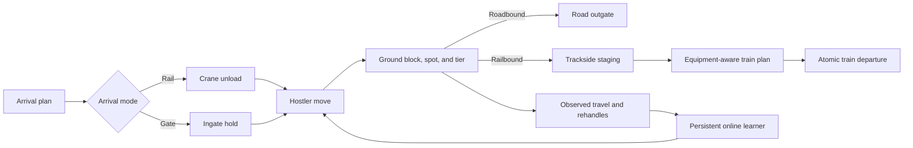

# Intermodal Railyard Simulator

[](https://github.com/SamsonMortensen/Yard_Management_Simulator/actions/workflows/tests.yml)
[](https://www.python.org/)
[](LICENSE)
[](RELEASE_NOTES.md)

**Current release:** v0.2.0, Physical Yard and Adaptive Dispatch

A working model of an intermodal rail terminal: trains discharging on the track, cranes
working double stack wells, hostlers moving units around the yard, and outside drivers
coming through the gate to drop off and pick up.

I spent some time as an Intermodal Equipment Operator. The operational details here come from that, not from a
textbook. The concurrency and database work is the part I built to learn cloud data
engineering.

I also earned a bachelor's degree in Data Analytics. This project is where I bring those
two sides of my background together. I am using the operating experience to decide what
the model needs to respect, then using data engineering, simulation, and analytics to
measure what happens.

This is a portfolio and research simulator. It is not presented as production terminal
management software. The goal is to build something operationally recognizable, make the
assumptions visible, and verify the results instead of hiding behind a polished demo.

## The problem it models

A yard runs on knowing where every unit is. When the database lags behind what is
physically happening on the ground you get dry runs (a driver shows up for a box that
is not available), misparks, and capacity numbers nobody trusts. Two workers going after
the same container is not a rare edge case either, it happens constantly during a train
offload.

So the question this project answers is: if several workers are hitting the same table at
once, what actually keeps the data correct, and what does it cost.

## System flow



The arrows describe work movement. The database conditions still decide whether a move
is allowed to land. The learner can rank valid work, but it cannot change a safety rule.

## Run it

```bash
pip install -r requirements.txt
python simulate.py
```

No AWS account needed. That runs a full shift against an in-memory stand-in
(`mock_dynamo.py`) and prints the correctness checks, the write contention count, and the
read cost.

The engines are not modified to make this work. `main.py`, `crane.py`, `hostler.py`,
`outgate.py` and `dispatch_check.py` run exactly as they would against real DynamoDB.
`config.get_table()` just hands them a different table object. Every conditional write and
every query is the real one. Only the simulated drive and lift times are compressed, with
`--speed`.

```bash
python simulate.py --unsafe               # same shift with the conditional writes removed
python simulate.py --claim dispatch       # claim before driving instead of racing
python simulate.py --claim adaptive       # online learner improves dispatch across shifts
python simulate.py --well-capacity 4      # force railbound units to roll to the next train
python simulate.py --max-tiers 4          # change ground stack height
python simulate.py --block-size 80        # change travel distance between yard blocks
python simulate.py --cranes 2 --hostlers 4
python simulate.py --verbose              # show the engines' own output
python -m pytest -q                       # 29 automated tests
python test_yard.py                       # 77 narrated assertions
python scale_experiment.py --runs 5       # matched scale and learning experiment
```

One representative verified run produced the following summary:

```text
Correctness & Data Integrity
  every lifecycle transition is valid           [PASS]  40 containers audited
  every parked unit holds one ground-tier lock  [PASS]
  departures by mode:                            {'Road': 20, 'Rail': 20}
  outbound train:                                20 loaded and departed
  hostler travel / rehandles:                    1,235 block hops / 6 rehandles

Automated verification
  pytest                                          29 passed
  narrated assertions                             77 passed, 0 failed
```

Travel and contention totals vary with the random arrival mix. The lifecycle and
reservation checks are invariants and must pass on every guarded run.

## How a unit moves

Two terminal flows, named for how the unit will leave. This deliberately avoids
`import` and `export`, which describe international trade rather than the next yard move.

**Roadbound.** Comes in on a train, leaves through the road outgate.

```
Trackside_Hold  ->  Buffer_Hold      ->  Parked  ->  Departed (Road)
(on the railcar)    (crane set it         (hostler     (customer cleared
                     on a chassis)         parked it)   the gate and took it)
```

If a hostler already has a chassis backed in when the crane picks the box up, it goes to
`Rendezvous_Wait` instead of `Buffer_Hold` and that hostler takes it straight off.

**Railbound.** Comes in through the road gate, leaves on an outbound train.

```
Ingate_Hold  ->  Parked  ->  Awaiting_Rail  ->  Loaded_Rail  ->  Departed (Rail)
(driver         (hostler     (hostler took      (crane set      (train left)
 dropped it)     parked it)   it trackside)      it in a well)
```

`Current_Status` stays `Departed` for both. Which way it left is a separate field,
`Departure_Mode`. Splitting the terminal state in two would have broken eleven readers
that filter on `Departed`, so it is one state with an attribute.

New records use `Planned_Departure_Mode = Rail | Road`. Older manifests with
`Direction = Export | Import` are translated at the boundary and remain readable.

**Stack order is enforced.** A double stack well holds a bottom and a top. The top comes
off first on offloads, and the bottom goes in first on loading. Each unit carries
`Railcar_ID`, `Well_Position` and `Blocked_By`, and the crane will not lift something that
is still pinned under another box. A unit that is claimed but not yet lifted still blocks,
because it is physically still sitting there.

Ground storage is physical too. A reservation names the exact spot and tier, such as
`GROUND#1500#2`. The allocator groups compatible flows, favors common rail destinations,
and places shorter-dwell work above longer-dwell work. Before a hostler or road driver can
retrieve a buried unit, every blocker above it is moved to another atomically reserved
location. Those rehandles and block-to-block travel become measured operating costs.

## What keeps it correct

Every state change is a conditional write. The hostler updating a unit to `Parked`
requires that it is still `Ingate_Hold` when the write lands. If another hostler got there
during the drive, the write is rejected and this one goes back and rescans. No locks and
no coordinator process.

To show that this is actually doing something rather than just sounding good, there is a
control mode. `--unsafe` runs the identical shift with the conditions removed:

| | Conditional writes on | Conditional writes off |
| --- | :---: | :---: |
| Containers double parked | 0 | many |
| Park writes for N containers | exactly N | more than N |
| Conflicts raised | one per lost race | 0, nothing detects them |

The unsafe run raises zero database errors and quietly corrupts the yard. That is the
point. The conflict count in a normal run is not overhead, it is the number of misparks
the database stopped.

**Four ways to pick the next unit**, and they trade off differently:

- `head` takes the front of the queue, so every worker goes after the same box and all but
  one lose. Losers rescan and can lose again, so contention grows with crew size, not just
  with volume. Measured: 60 containers with 2 hostlers gives about 2.5 lost races per
  container, 200 containers with 6 hostlers gives about 8.
- `random` draws from anywhere in the queue. Collisions mostly go away, and so does
  arrival order.
- `dispatch` sorts by arrival time and claims the unit before driving to it. A lost race
  costs a retry instead of a wasted trip. The explicit sort matters because DynamoDB does
  not promise FIFO order from a partition-only status index.
- `adaptive` keeps the same atomic claim and physical rules, but an online UCB bandit
  learns which readable retrieval rule performs best: FIFO, nearest block, or earliest
  cutoff. Completed moves reward throughput and penalize observed block travel and
  rehandles. Its small JSON policy persists across shifts, so it continues learning from
  each physical outcome rather than retraining from scratch. Machine learning chooses
  only among valid moves; it cannot waive a cutoff, reverse stack order, overfill a well,
  or bypass a status precondition.

## Scale and learning results

I do not want to claim the learner is improving just because its JSON file changes. The
scale experiment gives every strategy the same arrival seeds and records correctness,
travel, rehandles, contention, rollovers, labor time, and wall-clock runtime. The adaptive
policy continues learning from one shift to the next. Fixed strategies do not change.

```bash
python scale_experiment.py --sizes 100 200 --runs 5 \
  --strategies head random dispatch adaptive \
  --seed 10100 --well-capacity 33 --reset-policy \
  --policy-file scale_policy_published.json

# Continue the trained policy into one larger stress shift.
python scale_experiment.py --sizes 400 --runs 1 \
  --strategies head random dispatch adaptive \
  --seed 13100 --well-capacity 33 \
  --policy-file scale_policy_published.json
```

The 33-well limit caps the theoretical train at 99 positions. That stays inside the
100-action atomic departure boundary and deliberately creates rollover pressure as yard
volume grows.

| Units | Strategy | Runs | Correct | Block hops/unit | Rehandles/100 | Mean rollovers | Units/labor hr |
| ---: | :--- | ---: | :---: | ---: | ---: | ---: | ---: |
| 100 | head | 5 | 5/5 | 30.48 | 5.40 | 4.0 | 3.89 |
| 100 | random | 5 | 5/5 | 39.43 | 6.80 | 1.8 | 3.57 |
| 100 | dispatch | 5 | 5/5 | **22.37** | 10.20 | 7.4 | **4.45** |
| 100 | adaptive | 5 | 5/5 | 29.22 | 16.00 | 2.2 | 4.05 |
| 200 | head | 5 | 5/5 | 27.24 | 5.40 | 41.6 | 4.10 |
| 200 | random | 5 | 5/5 | 41.92 | 6.50 | 30.4 | 3.49 |
| 200 | dispatch | 5 | 5/5 | **21.68** | 9.20 | 48.2 | **4.56** |
| 200 | adaptive | 5 | 5/5 | 30.93 | 18.30 | **28.8** | 3.97 |
| 400 | head | 1 | 1/1 | 44.64 | 21.50 | 120 | 3.17 |
| 400 | random | 1 | 1/1 | 44.02 | 6.50 | 122 | 3.43 |
| 400 | dispatch | 1 | 1/1 | **28.15** | 18.00 | **121** | **4.16** |
| 400 | adaptive | 1 | 1/1 | 28.59 | 22.00 | 126 | 4.12 |

The honest result is that adaptive dispatch is safe and it learned across 2,396 decisions,
but it does not beat fixed dispatch yet. Dispatch used less travel and labor at 100 and
200 units. Adaptive dispatch produced fewer rollovers in those replicated tiers, then lost
that advantage in the single 400-unit stress run. The learned policy selected FIFO for
1,974 decisions, nearest for 270, and cutoff for 152.

That is useful, not embarrassing. It tells me the current reward and three global actions
are too simple. The next learning experiment needs more operating context and broader
multi-shift validation.
The 400-unit row is a stress observation, not a statistical conclusion. The complete
published summary is in [`results/scale_v0.2.0_summary.csv`](results/scale_v0.2.0_summary.csv).

## Outbound train pressure

`train.py` plans against individual 40- and 53-foot wells. It enforces container length,
single-unit and combined stack weight, bottom foundations, top-versus-bottom weight, and
one destination block per well. Two 20-foot units may share the bottom A/B positions.
A train cannot depart before its cutoff. At cutoff, every loaded railbound unit transitions
in one atomic transaction; units still in `Awaiting_Rail` are counted as rolled to the
next train.

The default programmatic simulation sizes the train generously so regression tests can
complete a full lifecycle despite equipment and destination fragmentation. Use
`--well-capacity` to make the constraint bind. A nominal well count is no longer equivalent
to a guaranteed container count because the consist must remain physically loadable.

## Reads

The engines query a `Current_Status` GSI (`StatusIndex`) through `config.query_status()`,
so a hostler looking for gate units reads only the gate units.

This was not the original design. It used to poll with `Scan` plus a filter, which reads
every row in the table and charges for every row no matter how few match. The cost of that
grows with the square of yard size, because the number of polls grows with the yard too:

| Containers | Rows read | Per container |
| ---: | ---: | ---: |
| 100 | 61,250 | 612x |
| 200 | 244,900 | 1,224x |
| 400 | 940,200 | 2,350x |

Four times the rows for twice the containers, measured. Loading a real day of PANYNJ
volume is what made that visible. At demo scale it looks fine.

## Demand forecasting

`demand_forecast.py` works on real monthly TEU volume for nine US container ports (BTS
dataset `iahn-a7j4`, 2020 to 2023), including NY/NJ.

44 months for one port is not enough to train on, so the model pools all nine ports and
learns the shape rather than the level. That comparison is the result:

| Model | MAPE | vs naive |
| :--- | ---: | ---: |
| naive seasonal (same month last year) | 22.3% | baseline |
| ridge, one port only | 11.7% | +48% |
| ridge, pooled across ports | 8.9% | +60% |
| gradient boosting, pooled | 6.2% | +72% |

Pooling beats the single port model by 24% on identical folds, same algorithm. Evaluation
is rolling origin, one step ahead, never shuffled.

Unsupervised passes on the same data: PCA finds one national demand factor explaining 60%
of variance across the nine ports, peaking May 2022 and bottoming May 2020. KMeans on
seasonal shape separates the West Coast ports from the East and Gulf group without being
told where any of them are.

Classical seasonal decomposition is also in here as a comparison, and it is a useful one.
On the stable 2000 to 2015 PANYNJ series it holds 4.1% MAPE against a held out six months,
beating a naive seasonal baseline at 8.6%. On the 2020 to 2023 COVID window it goes to
36.4% and loses to the naive baseline, because a straight line trend cannot represent the
import surge and the destocking crash after it. Newer data is not automatically better
data.

## What is in the repo

| File | What it does |
| :--- | :--- |
| `main.py` | Arrivals, physical attributes, dwell-aware ground assignment |
| `yard_topology.py` | Blocks, multi-tier reservations, access checks, rehandles |
| `crane.py` | Unloading and loading, stack precedence, sweep strategy |
| `hostler.py` | Yard moves both directions, dual cycling |
| `outgate.py` | Road departures for roadbound units after target dwell |
| `train.py` | Equipment-aware well planning, cutoff, atomic departure |
| `dispatch_check.py` | Gate authorization check |
| `config.py` | Settings, GSI query helper, scan helper |
| `mock_dynamo.py` | In-memory DynamoDB stand-in, so this runs with no account |
| `simulate.py` | Runs a shift, collects telemetry, checks invariants |
| `flow.py` | Railbound/roadbound terminology and legacy manifest compatibility |
| `adaptive_policy.py` | Persistent online dispatch learner with safety boundaries |
| `transition_audit.py` | Per-container ordered lifecycle validation |
| `atomic_ops.py` | Transactional departure/release and blocker relocation |
| `RELEASE_NOTES.md` | Scope and verification record for the public release |
| `test_yard.py` | Unit, concurrency, physical, lifecycle, and learning tests |
| `build_manifest.py` | Builds a day's manifest from real port volume |
| `demand_forecast.py` | Supervised and unsupervised models on BTS port data |
| `contention_analysis.py` | Does queue depth or yard occupancy drive contention |
| `benchmark_sweep.py` | Crane sweep strategy comparison on a simulated clock |
| `scale_experiment.py` | Reproducible scale and adaptive-policy comparison |
| `results/scale_v0.2.0_summary.csv` | Published v0.2.0 scale results |
| `app.py` | Streamlit dashboard |

## What this does not model

Worth being straight about the edges.

- Chassis are unlimited. They were not the limiting constraint in the operation I knew,
  but a terminal that runs short of them behaves very differently.
- Ground crew removing cone locks is a fixed delay, not a crew with limited capacity.
- No hazmat segregation, no reefer plug in tracking, no bad order or M&R track.
- Train consists are generated in place; switching moves, track occupancy, and locomotive
  availability are not yet modeled.
- Weight rules are well-level operational approximations, not a complete railroad load
  plan or axle-by-axle engineering calculation.
- The physical track layout is not yet active. Track dimensions, clearance, and occupancy
  remain outside the current release.

The harness records every successful in-memory status transition and audits each container's
ordered lifecycle. This replaces the former aggregate write multiplier, which could not
distinguish a missing transition from an offsetting duplicate transition.

One thing that is not a gap, just slow: `contention_analysis.py` needs 15 to 20 minutes for
a full pass. Three claim strategies, each running 200 containers against 800 seeded units
at speed 0.05. It is not stalled. The seeded inventory and the slow clock are both load
bearing, so shortening the run costs you the result.

## Further work

- Expand the physical track and train-planning model.
- Continue multi-shift evaluation of adaptive dispatch against fixed baselines.
- Add more equipment and resource constraints.
- Extend the lifecycle ledger into a durable chain of custody.

## Release history

- `v0.2.0`: physical ground stacks, rehandles, constrained outbound wells, transactional
  departures, online adaptive dispatch, lifecycle auditing, and public CI.
- Future work: broader physical track and train-footage planning.

See [RELEASE_NOTES.md](RELEASE_NOTES.md) for the public release record.

### Note on single table design

Adding a second record type (now `GROUND#spot#tier` reservations) to the table silently broke every
reader that assumed one shape: the dashboard counted spot locks as containers, the harness
raised a KeyError on records with no status, and scan pagination reset when a cursor row
was deleted mid scan. Nothing errored. The numbers were just wrong. If you put more than
one entity type in a table, every read has to filter by type, and the failure mode when you
forget is silence.
